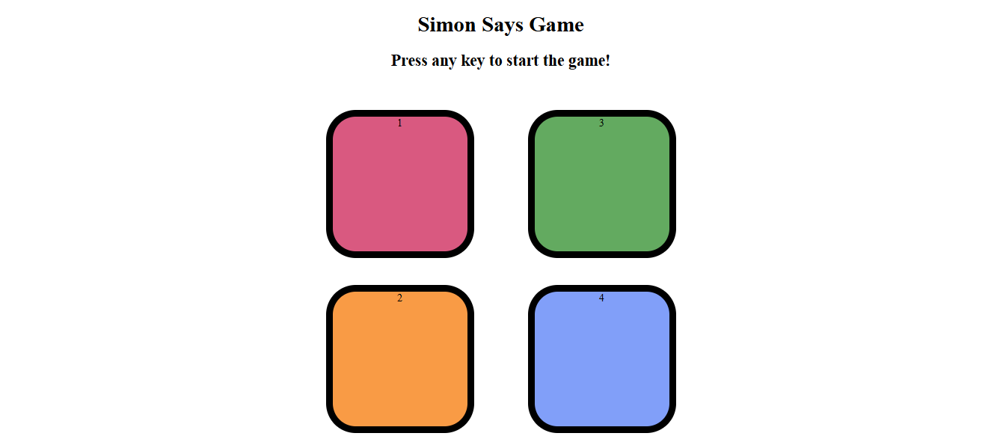

# Simon Says Game 
A browser-based memory game built with vanilla JavaScript, HTML, and CSS. The game generates a growing sequence of colors that the player must repeat correctly to advance levels.

## Live Demo
 https://pal-b7.github.io/Simon-Says/

## Screenshots


## Features
- Classic Simon Says gameplay — a randomly generated color sequence grows by one step each level
- Press any key to start the game
- Click-based input with visual feedback (button flash on both computer-generated and user clicks)
- Level counter displayed live during gameplay
- Highest score tracking within a session (updates if you beat your previous best)
- Red screen flash on incorrect input as a visual "game over" cue
- Automatic game reset after a wrong answer, ready for a fresh attempt

## Tech Stack
- HTML5
- CSS3 (Flexbox for button layout)
- Vanilla JavaScript (no frameworks or libraries)

## What I Learned
- Managing game state with plain JavaScript variables (sequence arrays, level counter, game-started flag)
- Generating and comparing sequences using arrays and index-based validation
- Using `setTimeout` to control timing for flash animations and level transitions
- Attaching and looping through event listeners (`querySelectorAll` + `for...of`) to wire up multiple buttons at once
- Using `keypress` as a game-start trigger, separate from the click-based gameplay itself

## Challenges I Faced
- Coordinating timing between the sequence flash animation and the next level starting, so they don't overlap or feel rushed
- Comparing user input against the game sequence step-by-step (rather than all at once) to catch mistakes immediately instead of waiting until the full sequence is entered

## Future Improvements
- Add sound effects for each button press and for the game-over state
- Persist highest score using `localStorage` so it survives page refreshes (currently resets on reload)
- Add a visible "Start" button as an alternative to the keypress trigger

## How to Run Locally
1. Clone the repository
   ```bash
   git clone https://github.com/Pal-b7/Simon-Says.git
   ```
2. Navigate into the project folder
   ```bash
   cd Simon-Says
   ```
3. Open `index.html` in your browser

## Folder Structure
```
Simon-Says/
├── index.html
├── style.css
├── app.js
├── Screenshot.png
└── README.md
```

## License
This project is for educational purposes only.